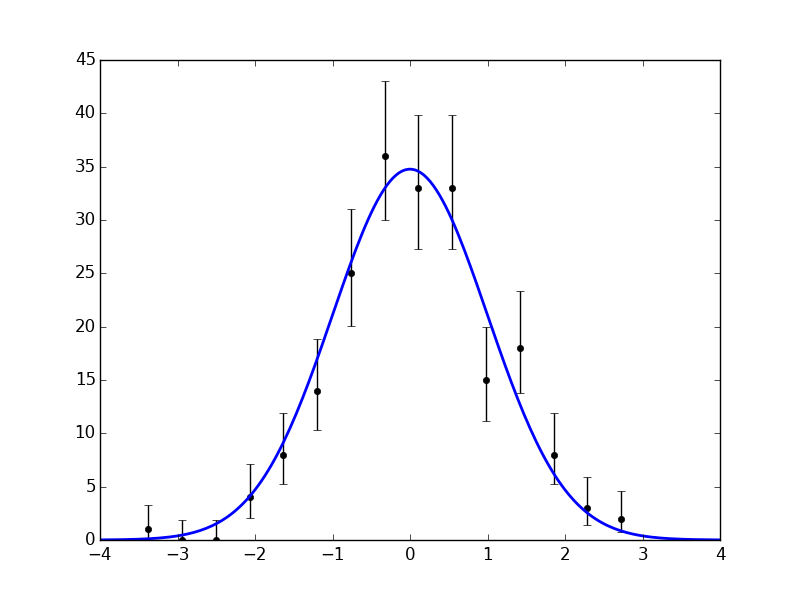
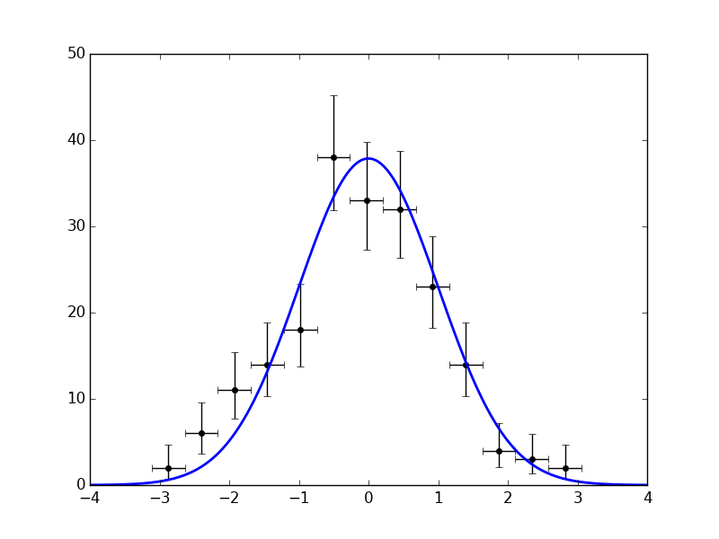
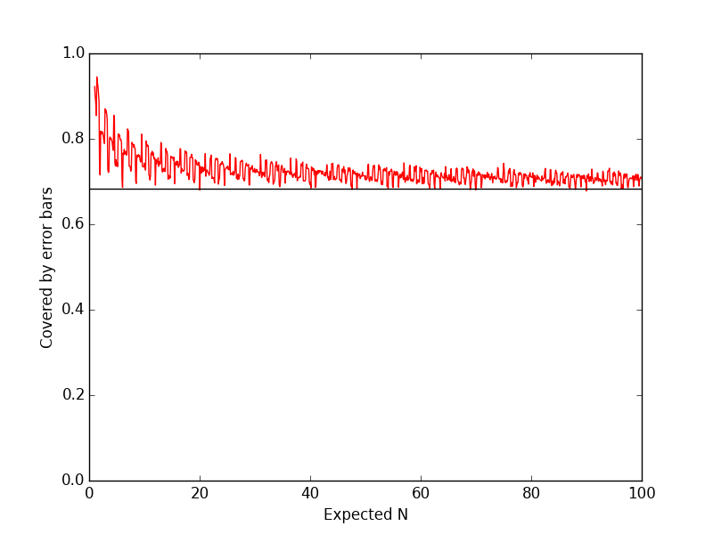

# missing\_hep

A collection of functions to simplify and speed up High Energy Physics research with Python.

## Installation

To install the package to your home directory with pip, run

```python
pip install --user git+https://github/ibab/missing_hep
```

## The histpoints plotting function

In High Energy Physics, histograms are often displayed as a collection of data points, one for each bin.
This allows one to attach error bars to each individual bin.

It can be debated if it is correct to attach error bars to the individual bin contents as opposed to the underlying model expectation,
as we want to know if the expectation can fluctuate to become the data and not vice versa.
But this is a convention widely used by the HEP community, and thus a way to use this style of plotting in Python is often necessary.

A simple way to create these kinds of plots is missing from other Python packages like matplotlib.
The `histpoints` function is designed to produce these plots conventiently, like in the following example:

```python
from missing_hep import histpoints
import matplotlib.pyplot as plt
import numpy as np
import scipy.stats as stats

data = np.random.normal(0, 1, 200)
x, y, norm = histpoints(data)

x = np.linspace(-4, 4, 200)
plt.plot(x, norm * stats.norm.pdf(x, 0, 1), 'b-', lw=2)

plt.savefig('histpoints.png')
```



Or, displaying horizontal error bars to mark the bin width:
```python
histpoints(data, xerr='binwidth')
```



By default, the number of bins is chosen automatically via the Freedman-Diaconis rule.

Notice also that the vertical error bars in this example are asymmetric, as opposed to the symmetric `sqrt(N)` error bars often seen in HEP publications.
As the Poisson distribution becomes increasingly asymmetric for small count expectations, this is more accurate if there are few data points per bin.

By default, `histpoints` uses the gamma distribution to calculate asymmetric error bars.
The frequentist coverage properties of this approach can be seen from the following demonstration:

```python
import numpy as np
from scipy.stats import poisson, gamma
import matplotlib.pyplot as plt

def err(N, confidence=0.6827):
    alpha = 1 - confidence
    upper = np.zeros(len(N))
    lower = np.zeros(len(N))
    lower = gamma.ppf(alpha / 2, N)
    lower[N==0] = 0
    upper = gamma.ppf(1 - alpha / 2, N + 1)
    return N - lower, upper - N

cov = []

Ns = np.linspace(1, 100, 1000)

for N in Ns:
    data = poisson.rvs(N, size=10000)
    lower, upper = err(data)
    inside = sum((data - lower <= N) & (N <= data + upper))
    cov.append(inside / len(data))

plt.plot(Ns, cov, 'r-')
plt.axhline(0.6827, color='k')
plt.ylim(0, 1)
plt.ylabel('Covered by error bars')
plt.xlabel('Expected N')
plt.savefig('coverage.png')
```



